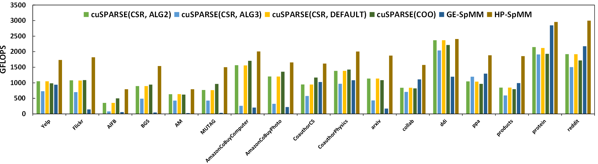

# Fast Sparse GPU Kernels for Accelerated Training of Graph Neural Networks

This is the updated version of the methods proposed  in "Fast Sparse GPU Kernels for Accelerated Training of Graph Neural Networks", accepted by IPDPS 2023. 

The code contains high-performance FP32 SpMM implementations (for Ampere and Hopper Arch). 

Please cite:

```tex
@INPROCEEDINGS{10177444,
  author={Fan, Ruibo and Wang, Wei and Chu, Xiaowen},
  booktitle={2023 IEEE International Parallel and Distributed Processing Symposium (IPDPS)}, 
  title={Fast Sparse GPU Kernels for Accelerated Training of Graph Neural Networks}, 
  year={2023},
  volume={},
  number={},
  pages={501-511},
  doi={10.1109/IPDPS54959.2023.00057}}
```

## Get started

### Clone and compile the codes

Please make sure you are running on Ampere (A100, A800) or Hopper (H100, H800) GPUs.

Please use NVCC >= 11.8.

```bash
git clone 
mkdir build
cd build
cmake .. && make -j
```

### Prepare datasets

```bash
cd ./dataset
chmod +x download.sh
source download.sh
```

### Run experiments

```bash
source run.sh
```

### Expected performance on H800

We compare with cuSPARSE-12.2 and GE-SpMM (https://github.com/hgyhungry/ge-spmm.git). We set K to be 32, 64, and 128, and the average GFLOPS are reported.

